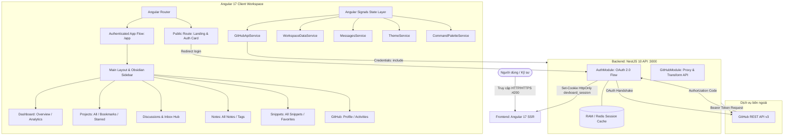

# 📘 Tài Liệu Kỹ Thuật Dự Án DevBoard (Project Documentation)

> **Tên dự án:** DevBoard (Developer Workspace & Engineering Tooling)  
> **Khách hàng / Phạm vi:** Nền tảng quản trị và không gian làm việc tập trung dành cho kỹ sư phần mềm  
> **Frontend Stack:** Angular 17.3+ (Standalone Components, SSR, Signals, Modern Control Flow, Lucide Icons)  
> **Backend Stack:** NestJS 10, TypeScript, Express, Cookie-parser, GitHub REST API OAuth 2.0  
> **Kiến trúc bảo mật:** HttpOnly Session Cookie (`devboard_session`), SameSite Lax, CORS Credentials  
> **Ngày cập nhật:** Tháng 09/2026  

---

## 1. 🎯 Tổng Quan Dự Án (Project Overview)

**DevBoard** là nền tảng không gian làm việc tập trung (All-in-one Developer Dashboard & Workspace) được thiết kế đặc thù cho các kỹ sư phần mềm. Dự án giải quyết bài toán phân mảnh công cụ hàng ngày bằng cách tích hợp quản lý mã nguồn GitHub thật, ghi chú kỹ thuật, kho lưu trữ code mẫu (snippets), thảo luận kỹ thuật và theo dõi tiến độ dự án vào một giao diện trực quan, tối giản theo ngôn ngữ thiết kế **Linear & Obsidian**.

### Mục tiêu cốt lõi:
* **Tích hợp hệ sinh thái GitHub thật:** Xác thực bảo mật OAuth 2.0, đồng bộ trực tiếp 21 repositories cá nhân, commit history, và đồ thị đóng góp 201 contributions/năm.
* **Quản lý dự án cá nhân (Projects Hub):**
  - Danh mục toàn bộ kho mã nguồn (`All Repositories`).
  - **Kệ Bookmarks độc quyền của DevBoard:** Tính năng lưu trữ độc lập trên ứng dụng web giúp lập trình viên ghim nhanh các dự án trọng tâm vào kệ làm việc cá nhân (Personal Focus Shelf).
  - **Starred Repositories:** Danh sách các kho mã nguồn được đánh dấu sao yêu thích.
* **Thảo luận kỹ thuật & Thông báo (Discussions & Inbox):** Theo dõi mentions, yêu cầu review code PR và thông báo hệ thống với giao diện chat thread và phản hồi nhanh đính kèm code snippet.
* **Ghi chú & Tài liệu hóa (Developer Notes):** Hỗ trợ viết ghi chú kỹ thuật dạng Markdown gắn liền với từng tag và dự án.
* **Kho lưu trữ Code Snippets:** Lưu và tái sử dụng các đoạn code chuẩn với tính năng 1-Click Copy vào clipboard.
* **Spotlight Command Palette (⌘K):** Tra cứu và điều hướng siêu tốc tới mọi ngóc ngách của ứng dụng.

---

## 2. 🏛️ Kiến Trúc Kỹ Thuật (Architecture & Tech Stack)

Hệ thống được thiết kế theo mô hình tách biệt Frontend và Backend (Decoupled Client-Server) với tính năng bảo mật Session Cookie HttpOnly.



### Chi tiết Tech Stack:
| Thành phần | Công nghệ / Thư viện | Vai trò & Đặc điểm |
| :--- | :--- | :--- |
| **Frontend Framework** | `Angular 17.3+` | Standalone Components, Signals (`signal`, `computed`, `effect`), cú pháp `@if`, `@for` |
| **Server-Side Rendering**| `@angular/ssr` + `Express` | SSR và Prerendering 14 static routes, tối ưu tốc độ FCP |
| **Backend Framework** | `NestJS 10.x` | TypeScript, Modular Architecture (`AuthModule`, `GitHubModule`), `cookie-parser` |
| **Bảo mật Session** | HttpOnly Cookie | Cookie `devboard_session`, `SameSite: Lax`, bảo vệ chống tấn công XSS/CSRF |
| **Data Persistence** | `Local-First` + `localStorage` | Lưu trữ trạng thái Bookmarks & Starred dự án phản ứng tức thì không phụ thuộc network lag |
| **UI Design System** | `Linear Obsidian` | Dark/Light Dual Theme, glassmorphism, glowing borders, active accent pills |
| **UI Iconography** | `lucide-angular` | Bộ icon SVG hiện đại, tinh gọn và đồng bộ |

---

## 3. 📂 Cấu Trúc Thư Mục Dự Án (Directory Structure)

```text
AngularProject/
├── PROJECT_CONTEXT.md               # Báo cáo tiến độ (Đã làm, Đang làm, Sẽ làm)
├── PROJECT_DOCUMENTATION.md         # Tài liệu kỹ thuật chi tiết (File hiện tại)
├── DEVELOPMENT_PLAN.md              # Kế hoạch phát triển tổng thể
│
├── backend/                         # MÃ NGUỒN BACKEND (NESTJS 10)
│   ├── package.json
│   ├── tsconfig.json
│   └── src/
│       ├── main.ts                  # Bootstrap NestJS server (CORS credentials, cookie-parser, port 3000)
│       ├── app.module.ts            # Root module kết nối AuthModule & GitHubModule
│       ├── auth/                    # Module xác thực GitHub OAuth 2.0
│       │   ├── auth.controller.ts   # /api/auth/github, /callback, /me, /logout
│       │   ├── auth.service.ts      # Trao đổi code lấy access token, quản lý session
│       │   └── auth.guard.ts        # Guard bảo vệ endpoint yêu cầu đăng nhập
│       └── github/                  # Module tích hợp GitHub API
│           ├── github.controller.ts # /api/github/user, /repos, /activities, /contributions
│           └── github.service.ts    # Fetch dữ liệu thật từ GitHub REST API
│
└── frontend/                        # MÃ NGUỒN FRONTEND (ANGULAR 17)
    ├── package.json                 # Quản lý dependencies (lucide-angular, @angular/ssr)
    ├── angular.json                 # Cấu hình workspace & budget limits (styles 80kb)
    ├── tsconfig.json                # TypeScript strict configuration
    ├── server.ts                    # Express SSR entrypoint
    └── src/
        ├── index.html
        ├── styles.css               # Global theme variables, reset, Obsidian canvas
        ├── main.ts / main.server.ts
        ├── assets/                  # devboard_logo.jpg, Avatar.jpg
        └── app/
            ├── app.component.*
            ├── app.routes.ts        # Định tuyến: /app/discussions, /app/projects/*,...
            ├── app.config.ts        # Providers (Router, Client Hydration)
            │
            ├── core/                # Dịch vụ lõi & State Signals
            │   ├── services/
            │   │   ├── github-api.service.ts       # Kết nối Backend NestJS, live user/repos
            │   │   ├── workspace-data.service.ts   # Quản trị Projects, Bookmarks, Starred
            │   │   ├── messages.service.ts         # Discussions state, unread badges
            │   │   ├── theme.service.ts            # Dark/Light theme toggle
            │   │   ├── command-palette.service.ts  # Tìm kiếm ⌘K toàn hệ thống
            │   │   └── user.service.ts             # Thông tin profile cục bộ
            │   └── data/                           # Mock fallback data (notes, snippets)
            │
            ├── layout/              # Khung hiển thị dùng chung
            │   ├── main-layout/     # Khung chính: Sidebar cố định + Content Router Outlet
            │   ├── sidebar/         # Linear Obsidian Sidebar đa năng
            │   │   ├── sidebar.component.ts        # Signals collapsed, menus, bookmarks
            │   │   ├── sidebar.component.html      # Brand lockup, nav, pinned shelf, telemetry
            │   │   └── sidebar.component.css       # Obsidian gradient, active pills, pulse
            │   └── command-palette/ # Modal tìm kiếm nhanh ⌘K
            │
            └── pages/               # Các trang giao diện chức năng
                ├── landing/         # Landing page & GitHub OAuth Login Card
                ├── dashboard/       # Dashboard Overview & Analytics
                ├── projects/        # All-projects, Bookmarks, Starred
                ├── messages/        # Discussions & Inbox (route: /app/discussions)
                ├── notes/           # All-notes, Tags
                ├── snippets/        # All-snippets, Favorites
                └── github/          # Profile, Activities
```

---

## 4. 🧭 Hệ Thống Định Tuyến (Routing & Navigation)

Hệ thống điều hướng được quản trị tại [frontend/src/app/app.routes.ts](file:///d:/Coding/Computer%20Science/Personal%20Project/PayooWork/AngularProject/frontend/src/app/app.routes.ts):

| Đường dẫn (URL Path) | Component đảm nhiệm | Chế độ | Chức năng chính |
| :--- | :--- | :---: | :--- |
| `/` | `LandingComponent` | Public | Giới thiệu DevBoard, nút đăng nhập GitHub OAuth an toàn |
| `/login` | *Redirect về `/`* | Public | Chuẩn hóa đường dẫn đăng nhập |
| `/app` | `MainLayoutComponent` | Auth | Khung layout chính (Redirect mặc định về `dashboard/overview`) |
| `/app/dashboard/overview` | `OverviewComponent` | Auth | Bảng chỉ số tổng quan, task trong ngày, PRs và CI/CD pipelines |
| `/app/dashboard/analytics`| `AnalyticsComponent`| Auth | Phân tích vận tốc code, phân bổ kích thước PR, biểu đồ commit |
| `/app/projects/all-projects`| `AllProjectsComponent`| Auth | Danh mục 21 repositories thật từ tài khoản GitHub, bộ lọc tag/ngôn ngữ |
| `/app/projects/bookmarks`| `BookmarksComponent` | Auth | **Kệ dự án lưu riêng của DevBoard**: Quản lý các repository được ghim |
| `/app/projects/starred` | `StarredComponent`   | Auth | Danh sách các kho mã nguồn ưa thích |
| `/app/discussions`       | `MessagesComponent`  | Auth | **Discussions & Inbox Hub**: Quản lý trao đổi code review, mentions |
| `/app/messages`          | *Redirect về `discussions`* | Auth | Tương thích ngược với liên kết cũ |
| `/app/notes/all-notes`   | `AllNotesComponent`  | Auth | Trình soạn thảo và danh sách ghi chú kỹ thuật |
| `/app/notes/tags`        | `TagsComponent`      | Auth | Phân loại ghi chú theo nhãn chuyên môn |
| `/app/snippets/all-snippets`| `AllSnippetsComponent`| Auth | Thư viện code snippets đa ngôn ngữ |
| `/app/snippets/favorites`| `FavoritesComponent`| Auth | Kho lưu trữ code snippets ưu tiên |
| `/app/github/profile`    | `ProfileComponent`   | Auth | Hồ sơ GitHub lập trình viên, đồ thị 201 contributions hàng năm |
| `/app/github/activities` | `ActivitiesComponent`| Auth | Dòng thời gian commit/PR thật, ma trận heatmap hoạt động |
| `**` (Wildcard)          | *Redirect về `/`*    | - | Bắt lỗi 404 và quay về trang chủ |

---

## 5. 🧩 Chi Tiết Các Tính Năng & Thành Phần Cốt Lõi

### 5.1. Đại Tu Thanh Điều Hướng Sidebar (`SidebarComponent`)
* **Ngôn ngữ thiết kế Linear Obsidian:**
  - Nền gradient sâu thẳm `radial-gradient` kết hợp viền sáng mờ `rgba(255, 255, 255, 0.08)`.
  - Typography thương hiệu: `DEV` in đậm sắc nét kết hợp `BOARD` với dải gradient công nghệ (`#818cf8` ➔ `#c084fc` ➔ `#f472b6`) và nhãn phụ `WORKSPACE`.
  - **Active Accent Pill:** Vạch dạ quang tím ở mép trái (`::before`) định vị trực quan mục menu đang mở.
  - Cây thư mục con (`tree-node`, `tree-curve`) có hiệu ứng glow sáng neon khi sub-item được chọn.
* **Cố định nút Toggle Sidebar:**
  - Nút tròn toggle cố định tại góc trên (`top: 27px; right: -13px`) cả khi mở và khi thu gọn, loại bỏ hiện tượng nút nhảy xuống đáy.
* **Giải quyết triệt để khoảng trống (Eliminating Dead Space):**
  - Đưa `Discussions` vào chung khối điều hướng liền mạch ngay dưới `Main`.
  - **Kệ "Pinned Repos" (Bookmarks Shelf):** Hiển thị danh sách các repo đã bookmark kèm chấm màu ngôn ngữ lập trình tương ứng, hỗ trợ truy cập 1-click tức thì.
  - **Thẻ Telemetry "DevBoard Sync":** Nằm phía trên Footer, hiển thị trạng thái `Connected Live`, tổng số Repositories (21), Pinned repos và GitHub Commits (201).
* **Profile Card & Status Dot:**
  - Avatar người dùng GitHub thật kèm chấm online xanh lá có hiệu ứng nhịp đập (`pulsing dot`).
  - Dropdown menu nổi hỗ trợ mở Profile, Repositories, GitHub và nút **Log out**.

### 5.2. Chuyển Đổi Hoàn Toàn Sang "Discussions"
* Thay thế khái niệm "Messages" bằng **Discussions & Inbox** phù hợp với môi trường kỹ thuật phần mềm.
* Điều hướng chính thức tại `/app/discussions`, tự động redirect `/app/messages`.
* Hỗ trợ tìm kiếm, lọc theo danh mục (`Mentions`, `Review requests`, `System alerts`), xem luồng hội thoại và gửi phản hồi kèm code snippet.

### 5.3. Projects Hub & Cơ Chế Bookmarks Độc Quyền
* Thay vì phụ thuộc vào GitHub (vốn không có tính năng Bookmarks), DevBoard xây dựng **Bookmarks** như một tính năng độc quyền dành riêng cho web app:
  - Cho phép lập trình viên ghim riêng các repository yêu thích vào kệ làm việc cá nhân.
  - Trạng thái `isBookmarked` và `isStarred` được lưu trữ Local-First qua `localStorage`, đồng bộ lập tức qua Angular Signals trong `WorkspaceDataService`.
* Loại bỏ toàn bộ mock repos rác, đồng bộ 100% 21 repositories thật từ GitHub của người dùng.

### 5.4. Tích Hợp GitHub API Real-Time
* `GitHubApiService` kết nối NestJS Backend lấy dữ liệu thật:
  - Tên, avatar, bio, số followers, public repos.
  - Lịch sử commits thật hiển thị trên dòng thời gian `ActivitiesComponent`.
  - Đồ thị 201 contributions hàng năm được tính toán chính xác theo từng tuần và từng ngày.

### 5.5. Spotlight Command Palette (⌘K)
* Mở bằng phím tắt `⌘K` (Mac) hoặc `Ctrl+K` (Windows/Linux) hoặc bấm vào thanh tìm kiếm ở Sidebar.
* Hỗ trợ tìm kiếm tức thì theo từ khóa qua tất cả các trang, dự án, ghi chú và đoạn code mẫu.

---

## 6. 🚀 Hướng Dẫn Cài Đặt & Vận Hành (Getting Started)

### 6.1. Yêu cầu môi trường
* **Node.js:** `>= 18.18.0` hoặc `>= 20.9.0`
* **npm:** `>= 9.x`
* **Angular CLI:** `17.x`

### 6.2. Cấu hình & Khởi chạy Backend (NestJS)
```bash
cd backend
npm install
# Cấu hình biến môi trường trong file .env:
# GITHUB_CLIENT_ID=your_client_id
# GITHUB_CLIENT_SECRET=your_client_secret
# SESSION_SECRET=your_session_secret
# FRONTEND_URL=http://localhost:4200
npm run start:dev
```
* Backend API hoạt động tại: `http://localhost:3000/api`

### 6.3. Cấu hình & Khởi chạy Frontend (Angular 17)
```bash
cd frontend
npm install
npm start
# Hoặc: ng serve
```
* Truy cập ứng dụng tại: `http://localhost:4200`

### 6.4. Đóng gói kiểm tra Production (Build Verification)
```bash
cd frontend
npx tsc --noEmit    # Kiểm tra 0 lỗi TypeScript
npm run build       # Biên dịch toàn bộ SSR bundle và 14 static routes
```

---

## 7. 📋 Kế Hoạch Phát Triển Tiếp Theo (Roadmap)

### Đã hoàn thành (Completed):
- [x] Monorepo kiến trúc hoàn chỉnh: Frontend (Angular 17 SSR) & Backend (NestJS 10 OAuth 2.0).
- [x] Tích hợp 100% dữ liệu GitHub thật (21 repos, 201 contributions, activities timeline).
- [x] Hệ thống Bookmarks độc quyền và Starred repos (Local-First Signal state).
- [x] Chuyển đổi toàn diện từ Messages sang Discussions (`/app/discussions`).
- [x] Đại tu giao diện Sidebar (Linear Obsidian, Active Pill, Pinned Repos shelf, Telemetry Sync card).
- [x] Spotlight Command Palette (⌘K) tra cứu nhanh toàn ứng dụng.
- [x] Khắc phục triệt để các lỗi template compiler và budget limit trong Angular 17.

### Kế hoạch tiếp theo (Upcoming):
- [ ] **Hoàn thiện nghiệp vụ người dùng cho Notes & Snippets:**
  - Xây dựng modal/trình soạn thảo Markdown để người dùng tạo mới, sửa, xóa ghi chú cá nhân.
  - Cho phép người dùng lưu thêm các snippet mới với syntax highlighter.
- [ ] **Giai đoạn 4: Database Persistence (Production Ready):**
  - Tích hợp PostgreSQL + Prisma ORM vào NestJS Backend để lưu session vĩnh viễn (chống mất session khi restart).
  - Lưu trữ Notes, Snippets và Bookmarks lên Cloud Database.
- [ ] **DevOps & Triển khai:**
  - Thiết lập Docker Compose chạy trọn gói Angular SSR, NestJS Backend và PostgreSQL.

